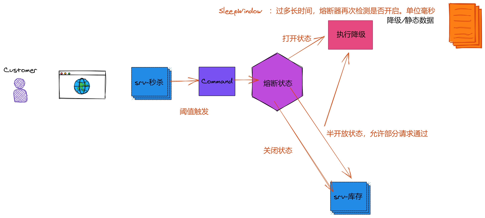
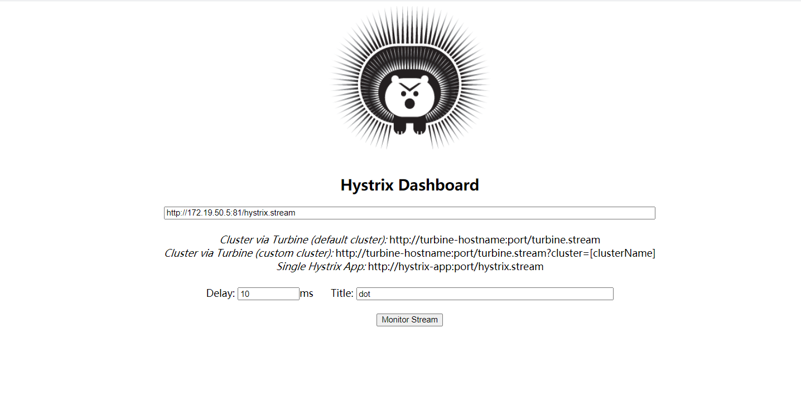
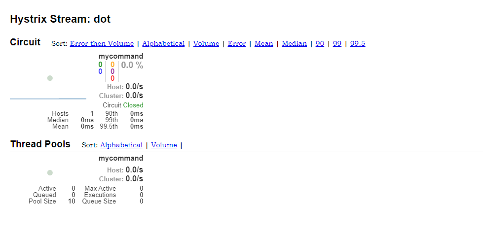

# 熔断过程




## 熔断服务 样例

```
	_ = hystrix.Do("mycommand", func() error {
		// command 代表一个服务
		
		_, err := http.Get("https://www.baidu.com")
		if err != nil {
			fmt.Printf("请求失败:%v\n", err)
			return err
		}
		return nil
	}, func(err error) error {
		//TODO 加入自动降级处理，如获取缓存数据等
		switch err {
		case hystrix.ErrCircuitOpen:
			// 熔断打开
			fmt.Println("circuit error:" + err.Error())
			msg = "ErrCircuitOpen"
		case hystrix.ErrMaxConcurrency:
			// 最大请求
			fmt.Println("circuit error:" + err.Error())
			msg = "ErrMaxConcurrency"
		default:
			fmt.Println("circuit error:" + err.Error())
			msg = "circuit error"
		}
		// 此处模拟响应时长
		time.Sleep(1 * time.Second)
		log.Println("sleep 1 second")

		return nil
	})
	r.Write([]byte(msg))
```


## 熔断配置

````
var config = hystrix.CommandConfig{
    Timeout:                5000, //执行command的超时时间(毫秒)
    MaxConcurrentRequests:  8,    //command的最大并发量
    SleepWindow:            1000, //过多长时间，熔断器再次检测是否开启。单位毫秒
    ErrorPercentThreshold:  30,   //错误率 请求数量大于等于RequestVolumeThreshold并且错误率到达这个百分比后就会启动
    RequestVolumeThreshold: 5,    //请求阈值(一个统计窗口10秒内请求数量)  熔断器是否打开首先要满足这个条件；这里的设置表示至少有5个请求才进行ErrorPercentThreshold错误百分比计算
}
````


## 打开监控

### 运行 dashbord

```
docker run -d -p 8080:9002 --name hystrix-dashboard mlabouardy/hystrix-dashboard:latest
```

> 打开  http://localhost:8080/hystrix




> 输入 hystrix 流输出监控地址   
>
> 配置监控延迟，配置标题





# 参考链接

https://gocn.vip/topics/9623

https://github.com/hwholiday/learning_tools/tree/master/go-kit/v8

https://chowdera.com/2021/03/20210325163614288Y.html