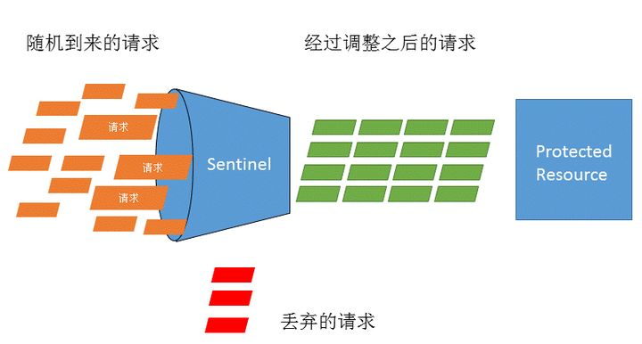

# Sentinel  教程

这里先介绍一下Sentinel的一些基本概念，方便大家理解，引用内容都是主要来自[官方文档](https://link.zhihu.com/?target=https%3A//github.com/alibaba/Sentinel/wiki/%E4%B8%BB%E9%A1%B5)

## 资源

> 资源是 Sentinel 的关键概念。它可以是 Java 应用程序中的任何内容，例如，由应用程序提供的服务，或由应用程序调用的其它应用提供的服务，甚至可以是一段代码。在接下来的文档中，我们都会用资源来描述代码块。
> 只要通过 Sentinel API 定义的代码，就是资源，能够被 Sentinel 保护起来。大部分情况下，可以使用方法签名，URL，甚至服务名称作为资源名来标示资源。

## 规则

> 围绕资源的实时状态设定的规则，可以包括流量控制规则、熔断降级规则以及系统保护规则。所有规则可以动态实时调整。

## Sentinel 功能和设计理念

### 什么是流量控制

> 流量控制在网络传输中是一个常用的概念，它用于调整网络包的发送数据。然而，从系统稳定性角度考虑，在处理请求的速度上，也有非常多的讲究。任意时间到来的请求往往是随机不可控的，而系统的处理能力是有限的。我们需要根据系统的处理能力对流量进行控制。Sentinel 作为一个调配器，可以根据需要把随机的请求调整成合适的形状，如下图所示：

### 流量控制设计理念

> 流量控制有以下几个角度:
> 资源的调用关系，例如资源的调用链路，资源和资源之间的关系；
> 运行指标，例如 QPS、线程池、系统负载等；
> 控制的效果，例如直接限流、冷启动、排队等。
> Sentinel 的设计理念是让您自由选择控制的角度，并进行灵活组合，从而达到想要的效果。

## 熔断降级

### 什么是熔断降级

> 除了流量控制以外，降低调用链路中的不稳定资源也是 Sentinel 的使命之一。由于调用关系的复杂性，如果调用链路中的某个资源出现了不稳定，最终会导致请求发生堆积。这个问题和 [Hystrix](https://link.zhihu.com/?target=https%3A//github.com/Netflix/Hystrix/wiki%23what-problem-does-hystrix-solve) 里面描述的问题是一样的。
> Sentinel 和 Hystrix 的原则是一致的: 当调用链路中某个资源出现不稳定，例如，表现为 timeout，异常比例升高的时候，则对这个资源的调用进行限制，并让请求快速失败，避免影响到其它的资源，最终产生雪崩的效果。

### 熔断降级设计理念

> 在限制的手段上，Sentinel 和 Hystrix 采取了完全不一样的方法。
> Hystrix 通过[线程池](https://link.zhihu.com/?target=https%3A//github.com/Netflix/Hystrix/wiki/How-it-Works%23benefits-of-thread-pools)的方式，来对依赖(在我们的概念中对应资源)进行了隔离。这样做的好处是资源和资源之间做到了最彻底的隔离。缺点是除了增加了线程切换的成本，还需要预先给各个资源做线程池大小的分配。
> Sentinel 对这个问题采取了两种手段:
> **通过并发线程数进行限制**
> 和资源池隔离的方法不同，Sentinel 通过限制资源并发线程的数量，来减少不稳定资源对其它资源的影响。这样不但没有线程切换的损耗，也不需要您预先分配线程池的大小。当某个资源出现不稳定的情况下，例如响应时间变长，对资源的直接影响就是会造成线程数的逐步堆积。当线程数在特定资源上堆积到一定的数量之后，对该资源的新请求就会被拒绝。堆积的线程完成任务后才开始继续接收请求。
> **通过响应时间对资源进行降级**
> 除了对并发线程数进行控制以外，Sentinel 还可以通过响应时间来快速降级不稳定的资源。当依赖的资源出现响应时间过长后，所有对该资源的访问都会被直接拒绝，直到过了指定的时间窗口之后才重新恢复。
> **系统负载保护**
> Sentinel 同时对系统的维度提供保护。防止雪崩，是系统防护中重要的一环。当系统负载较高的时候，如果还持续让请求进入，可能会导致系统崩溃，无法响应。在集群环境下，网络负载均衡会把本应这台机器承载的流量转发到其它的机器上去。如果这个时候其它的机器也处在一个边缘状态的时候，这个增加的流量就会导致这台机器也崩溃，最后导致整个集群不可用。
> 针对这个情况，Sentinel 提供了对应的保护机制，让系统的入口流量和系统的负载达到一个平衡，保证系统在能力范围之内处理最多的请求。

## Sentinel 是如何工作的

> Sentinel 的主要工作机制如下：
> 对主流框架提供适配或者显示的 API，来定义需要保护的资源，并提供设施对资源进行实时统计和调用链路分析。
> 根据预设的规则，结合对资源的实时统计信息，对流量进行控制。同时，Sentinel 提供开放的接口，方便您定义及改变规则。
> Sentinel 提供实时的监控系统，方便您快速了解目前系统的状态。

## Sentinel底层原理解析

下面进入到我们的底层原理部分，在这里我强烈建议如果读者之前没用过Sentinel 或者对Sentinel还不是很熟悉，先去[官方github](https://link.zhihu.com/?target=https%3A//github.com/alibaba/Sentinel)通读一下文档，最好本地跑一下demo。因为原理解析大部分都是解读源码为主，不是介绍入门。

关于原理介绍阿里官方也给出一份文档：[原理介绍](https://link.zhihu.com/?target=https%3A//github.com/alibaba/Sentinel/wiki/Sentinel%E5%B7%A5%E4%BD%9C%E4%B8%BB%E6%B5%81%E7%A8%8B)。文档中给出了大概的设计理念，但在技术细节上并没有详细说明，尤其是在高并发的环境下。本文也是在阿里给出文档的基础上结合代码进行更详细的描述。这里假设读者至少通读了阿里给出的[原理介绍](https://link.zhihu.com/?target=https%3A//github.com/alibaba/Sentinel/wiki/Sentinel%E5%B7%A5%E4%BD%9C%E4%B8%BB%E6%B5%81%E7%A8%8B)文档,并且了解Sentinel 基本概念，并跑过Demo。

## 参考文献

1. [官方文档]:https://sentinelguard.io/zh-cn/docs/basic-implementation.html

2. [ go夜读 sentinel 分享 ]: https://www.youtube.com/watch?v=Fhck_105l8o

3. [ PPT ]: http://slides.com/yutinglou/sentinel-go

4. 

   

